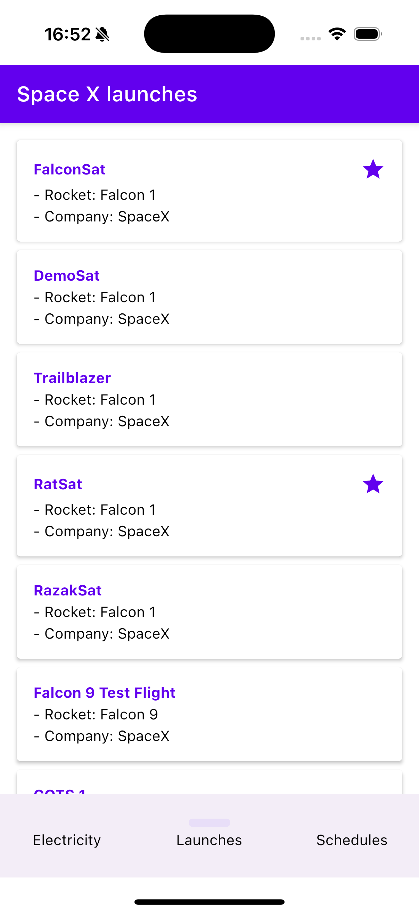

[](https://github.com/jarroyoesp/ComposeMultiplatformApp/actions/workflows/ci.yml)
[](https://github.com/JetBrains/compose-multiplatform/releases/tag/v1.8.2)

<div align="center">
    
    <h1>🚀 Example project to show SpaceX data built with Kotlin Multiplatform and Compose UI Multiplatform</h1>
</div>

[Compose Multiplatform](https://www.jetbrains.com/lp/compose-multiplatform/) Sample (KMP) that serves as a comprehensive example demonstrating the integration of Compose Multiplatform, GraphQL data consumption, and SQLDelight for local data persistence.

Using data from the GraphQL endpoint [SpaceX-GraphQL](https://studio.apollographql.com/public/SpaceX-pxxbxen/variant/current/explorer)

Current supported Platforms are:
1. Android
2. Desktop
3. iOS


# Features

## Home Screen 🚀
- List of SpaceX launches: Displays a list of SpaceX launches retrieved from a GraphQL endpoint.
- Show favorite Launches: retrieve data from local database to show your favorite launches
- Apollo GraphQL Integration: Utilizes GraphQL to fetch and display SpaceX launch data efficiently.
- SQLDelight Integration: Integrates SQLDelight for managing and persisting favorite launch data.
- Responsive UI: Provides a responsive user interface for seamless navigation and interaction across devices.
- Error Handling: Provides informative error messages and graceful handling of network and database errors.

## Detail Screen 🛸

- Detailed View: Navigate to a detailed view of each launch for more information.
- Save Favorites: Enables users to save their favorite launches to a SQLDelight database for persistence.

## Built With 🛠

- [Kotlin Multiplatform](https://github.com/JetBrains/compose-multiplatform)
- [Compose Multiplatform](https://github.com/JetBrains/compose-multiplatform): Enables cross-platform UI development with JetBrains' Compose framework.
- [Koin - DI](https://github.com/InsertKoinIO/koin): Dependency injection framework for Kotlin Multiplatform
- [Kotlin Coroutines](https://github.com/Kotlin/kotlinx.coroutines): Provides asynchronous programming utilities in Kotlin.
- [SQLDelight](https://github.com/cashapp/sqldelight): Generates Kotlin APIs from SQL statements for safer database interactions.
- [Apollo GraphQL](https://github.com/apollographql): Offers client-side tools for consuming GraphQL APIs.
- [Kotlin Multiplatform Navigation](https://www.jetbrains.com/help/kotlin-multiplatform-dev/compose-navigation-routing.html): Provides navigation components for Kotlin Multiplatform projects using Compose.
- [Kotlin Multiplatform ViewModel](https://www.jetbrains.com/help/kotlin-multiplatform-dev/compose-viewmodel.html): Manages UI-related data and state in Kotlin Multiplatform projects using Compose.
- [ConstraintLayout Multiplatform](https://github.com/Lavmee/constraintlayout-compose-multiplatform): Brings ConstraintLayout functionality to Kotlin Multiplatform projects with Compose.
- [Coil](https://coil-kt.github.io/coil/): Efficient image loading library for Compose multiplatform projects.
- [Logger](https://github.com/touchlab/Kermit): Logging library for Kotlin Multiplatform projects.
- [Unit Tests](https://github.com/junit-team/junit5): Automated tests to verify the behavior of individual code units.

## Android 🤖

|     |    |    |
|-------------------------------------------------------------|--------------------------------------------------------------|---------------------------------------------------------------|
|    |                                                              |                                                               |

## Desktop 🖥️

To execute the Desktop app run this `gradle` command:

```
./gradlew desktop:run
```

|     |    |    |
|-------------------------------------------------------------|--------------------------------------------------------------|---------------------------------------------------------------|
|    |                                                              |                                                               |

## iOS 🍎
Steps to setup your iOS app:
1. Create your iosApp using XCode
2. Add to your `Build phases`

```
cd "$SRCROOT/.."
./gradlew :modules:feature-home-shared:embedAndSignAppleFrameworkForXcode
```


3. Add to Search Paths:
```
$(SRCROOT)/../modules/feature-home-shared/build/xcode-frameworks/$(CONFIGURATION)/$(SDK_NAME)
```

More details [JetBrains official documentation](https://www.jetbrains.com/help/kotlin-multiplatform-dev/multiplatform-integrate-in-existing-app.html#make-your-cross-platform-application-work-on-ios)

|         |        |        |
|-------------------------------------------------------------|--------------------------------------------------------------|---------------------------------------------------------------|
|        |                                                              |                                                               |


### Get the latest version of the GraphQL schema
```bash
./gradlew :module:library-network-api:downloadApolloSchemaFromIntrospection
```

## Contributing 🤝

Issues or Pull request for any bugs/improvements are well received
